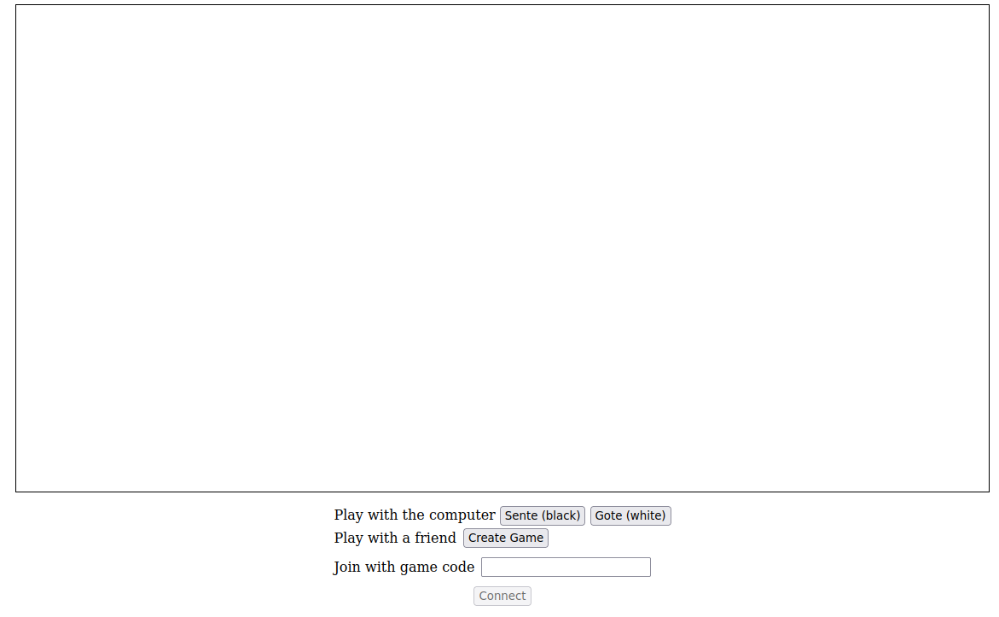
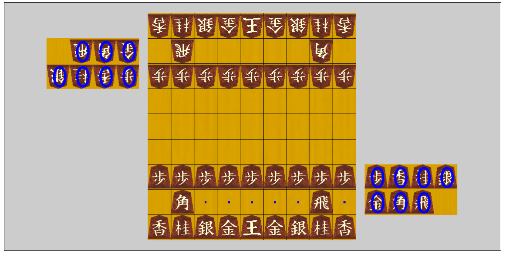
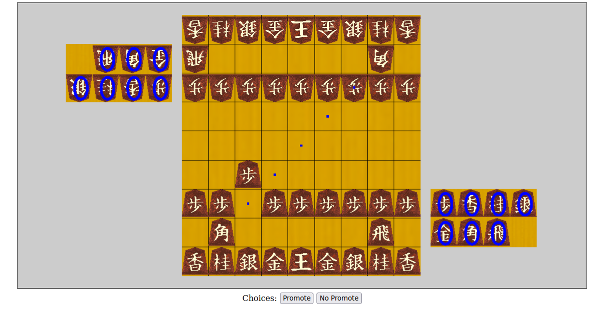
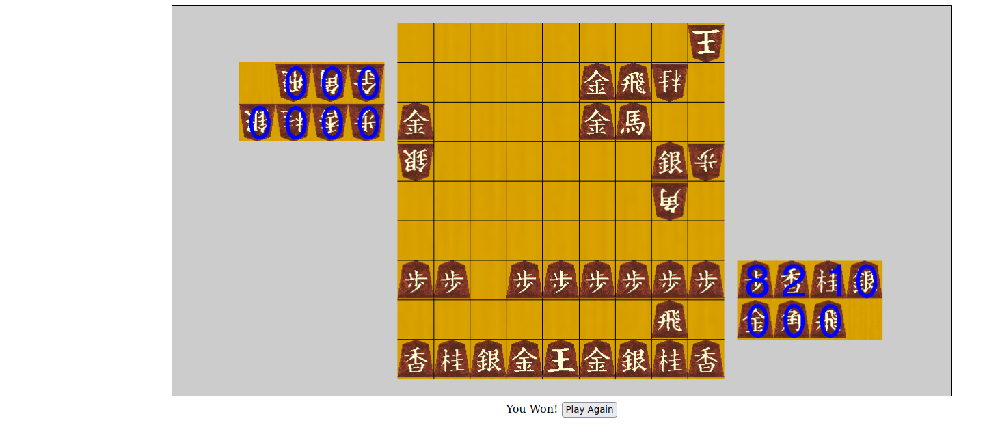

# Mai Shogi
## Shogi
- [rules](https://en.wikipedia.org/wiki/Shogi#Rules)
- play modes
    - vs computer
        - you can play vs the computer as Sente(you move first) or Gote(you move second)
    - vs player
        - you can play vs another player by creating and sharing a game code with them
    

- features
    - clicking on a piece that you control (on the board or in your hand) will cause the spaces that it can legally move to to be highlighted
    
    the rook can move left and right
    - when a piece can be promoted, the Svelte app will prompt you with buttons asking you whether or not you want to promote
    
    - when you win or lose the game, you will be informed by the Svelte app
    

- limitations
    - the computer makes random moves
    - there are bugs in the check logic
    - you cannot flip the board to look at the board from the other side
    - there are no indicators for when you are in check

## System
- Nginx serves static files and routes dynamic traffic to the Daphne/Django Channels web service
- the game logic and server are written in Python (Python 3)
    - `game/main.py`
- creating a game code creates two entries in Redis, each entry maps to the game code
    - the clients can request a websocket connection using their player code
    - the two clients will be put into a Channel that contains the two players
    - player one's websocket connection holds the game state and does the logic
        - this is not good, that should be a standalone program associated with the channel somehow, or a microservice?
- there is a postgres container, but it is currently not being used
    - it will be used for game history and account creation features

## Dev Environment
- Server
    - the application is containerized
        - you will need Linux (or maybe MacOs?) for Docker
        - you can of course use WSL2 on Windows
    - some shell scripts will need to be ran to finish the install
        - install_spa_to_server will install:
            - the client side apps (the game renderer and the Svelte UI)
            - it will also run the scripts necessary to convert Ka-hu's shogi SVGs into threejs objects, and then copy them into the static folder
                - the script is a nodejs script that uses Threejs to create game objects from the SVGs, and then serialize them to JSON
                - doing the SVG -> Object conversion at run time was really slow and couldn't be cached, so they are 'baked' beforehand and then served as static files
                - these object JSON files are unusually big (5MB???) (this needs fixed some how)
            - it will also move a Japanese font into the folder (I think we don't need this anymore, since the pieces are shown with SVGs and not text)
        - install_game_engine_to_server.sh will copy the python game logic code into the server's folder
            - we probably don't need this step, if the import statements from the Django code were written properly
        - install_game_svgs_to_server.sh used to copy the game svgs into the static folder, but it is no longer necessary 
- Client
    - the game rendering and user input is controlled by the game application `web/client/game`
    - the game application is instantiated by the svelte application `web/client/spa`
        - the svelte application has the game application listed as a file system dependency in the package.json file
    - the SPA and the game application communicate through a message queue
        - I'm not sure that it's correct to call it a Queue, but I wanted to try and separate the two incase I switch the SPA to use Elm instead of Svelte
    - the SPA talks directly to the server, the game application does not
        - web/client/spa/src/Glue has two files, GameClientCommunication and ServerClientCommunication that handles this message sending
        - I have 0 confidence that this is a good solution, but I wanted to try and build something like this

## Attributions
- Game Client Svgs - Ka-hu
    - [link](https://github.com/Ka-hu/shogi-pieces)
